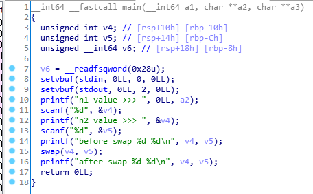
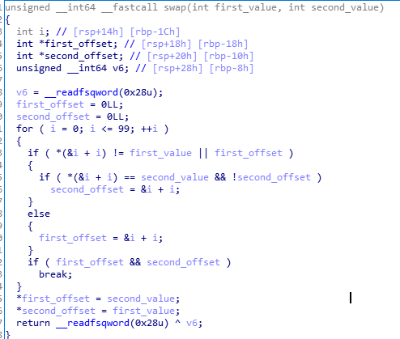

# Layer7 CTF 2017 pwnable My First Swap Function!

## Overview

## Analysis

The swap function will get two value.

But the values are not pointer.

So, the swap function will find value to swap.

Finally, if I will put the return address and function address that print flag, it will be print flag.

print flag function address is 0x400706 (4196102)

original return address is 0x4008df (4196575)

## Flag

Flag is `flag{UNSAFE_SWAP-_-}`.