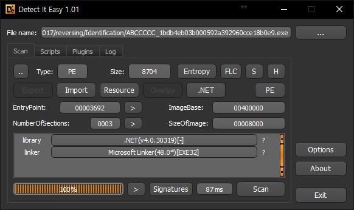
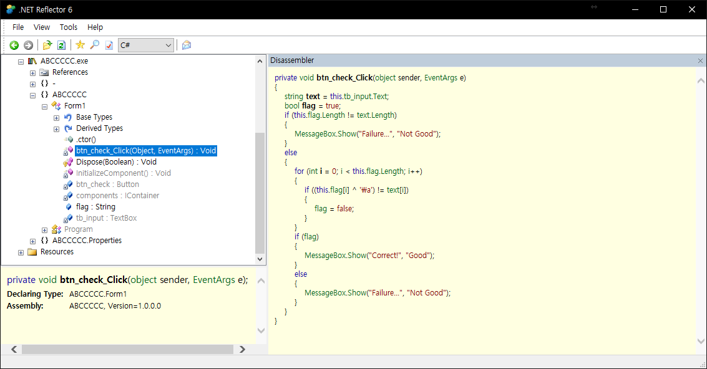
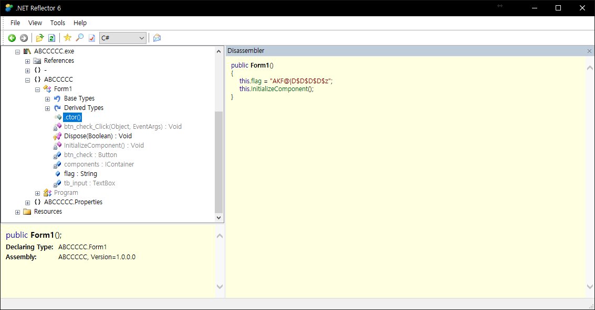
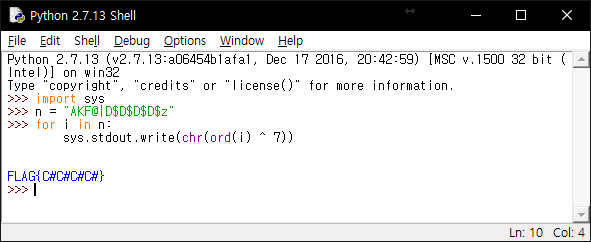

# Layer7 CTF 2017 crypto Layer7's Letter

## Overview

The problem gives me the file `ABCCCCC_1bdb4eb03b000592a392960cce18b0e9.exe`.

This file is executable file.

## Analyze

First, Look this file info with `DIE(Detect It Easy)`.

Oh! this is .Net File!

Now, let's open this file with `Reflector .Net Decompiler`.

It do xor with `\a` (0x7 in C#) and your input.

The encrypted text is used in compare with flag.

Where is flag?

Oh, here!

Finally, make a python script.

## Flag

`FLAG{C#C#C#C#}`