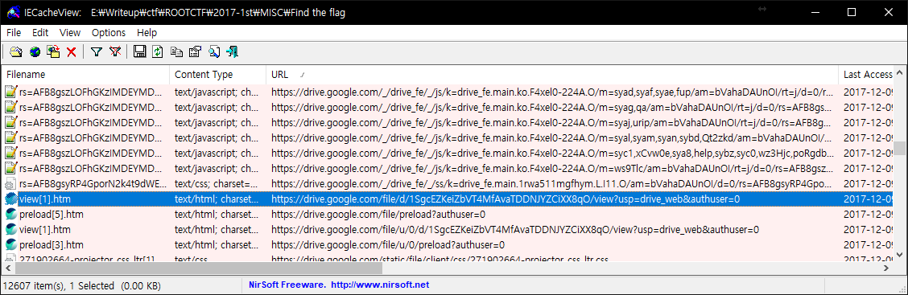
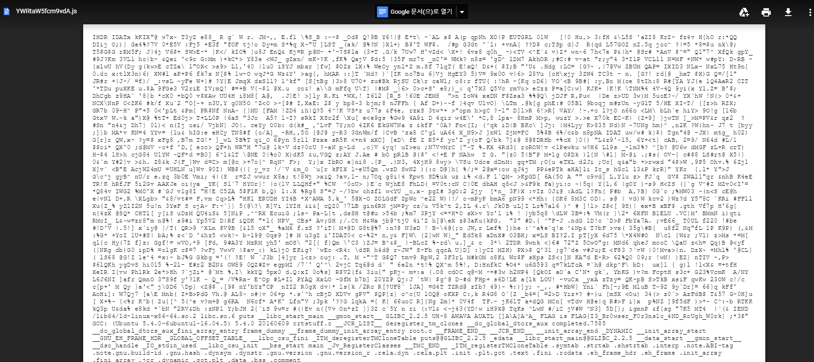
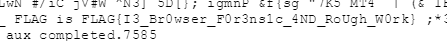

# ROOT CTF 2017 1st
## Overview
Find the flag

913

문제 출제자는 크리스마스에 혼자 보내야 된다는 생각에 화가 나서 플래그를 숨겨버렸습니다.
문제 출제자가 숨긴 플래그를 찾아주세요!
HINT:JS file,WebCacheV01.dat 분석
Link

## How to solve

문제에서 `WebCacheV01.dat` 파일을 준다.

분석을 위해서 `iecacheview` 라는 프로그램을 통해 열었다.

힌트에서 JS 파일을 집중해서 보라고 했다.

그렇게 분석하던중

수상한 구글 드라이브 경로를 발견했고, 들어갔더니

어떠한 파일이 나왔다.

그리고 아래 부분을 보니

플래그가 있었다.

## Flag
`FLAG{I3_Br0wser_F0r3ns1c_4ND_RoUgh_W0rk}`