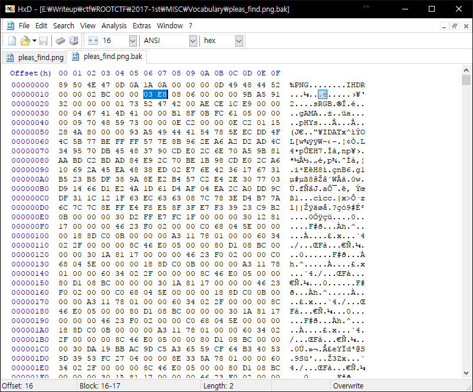
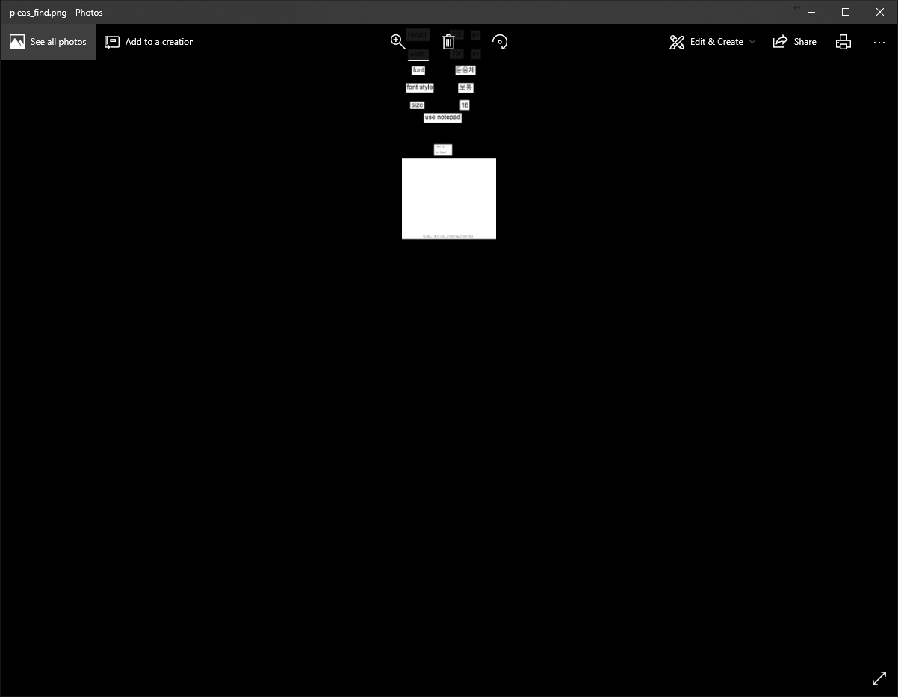
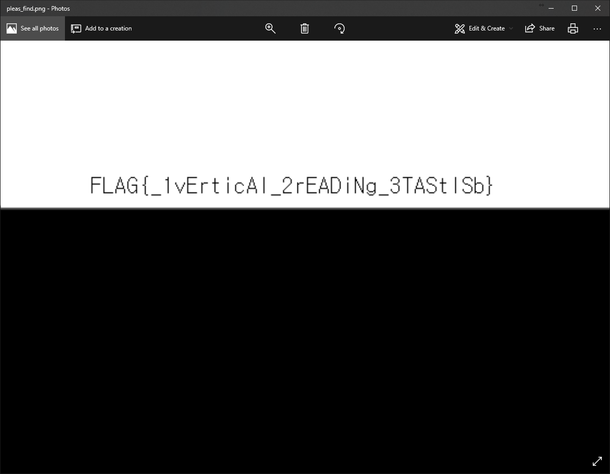

# ROOT CTF 2017 1st
## Overview
Vocabulary

460

플래그가 적힌 친구의 단어장을 잃어버렸다.
어서 빨리 찾아야 된다.
그 친구가 화내기 전에 플래그라도 찾아보자!

Link

## How to solve
파일을 Hex 로 열고 맨 아래로 내려보니
```
ThiS lEttEr wAS firSt iNtrODucED iN ENglAND AND luckED..ArOuND thE wOrlD A yEAr, AND NOw thiS lEttEr tO yOu ..ShOulD lEAvE yOu withiN fOur DAyS. YOu MuSt SEND SEvEN Of..thESE, iNcluDiNg thiS lEttEr, tO SOMEONE whO NEEDS gOOD..luck. COpyiNg iS AlSO rEcOMMENDED. It MAy bE ..SupErStitiON, but it iS truE.IN ADDitiON, thE FLAG MAy ..bE........bEE.......bEEEE.....{ tHANk_FiND_MY_vOCAbuLAry..}. MAybE NOt. Or iNcrEASE the hEight tO 1000px.
```
라는 문자열이 있다.

height 를 1000px 까지 올리라고 한다.

그래서 Hex 를 통해 사진에 표시한 부분을 바꿔 사진의 높이를 올렸다.



1000(0x3E8)까지 올리니까 맨 아래 Go Down 이라는 문자열이 나왔다.

그래서 엄청 더 값을 올리니까 플래그가 나왔다.

## Flag





`FLAG{_1vErticAl_2rEADiNg_3TAStlSb}`