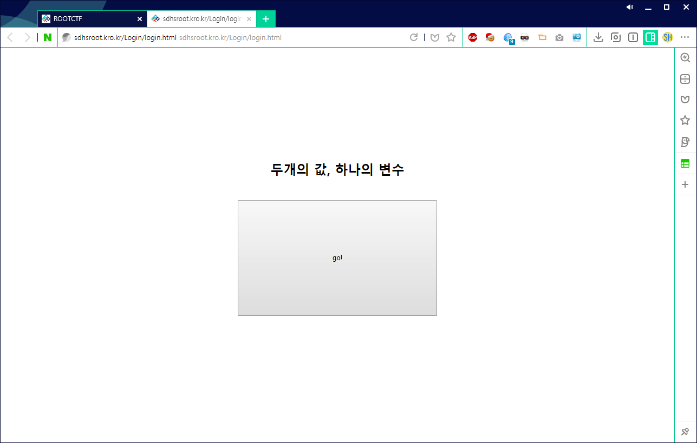
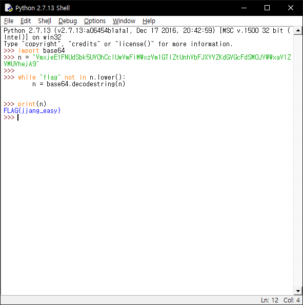

# ROOT CTF 2017 1st
## Overview
Login

50

로그인 페이지인데 로그인이 안된다... 
로그인을 성공하고 짱해커가 되어보자!!
Hint : Array, length<6
Hint2 : Get으로 배열을 전송하는 방법, sql injection
Link

## Process

먼저, 주어진 사이트에 들어가면 다음과 같은 화면이 뜬다.

그리고 get 버튼을 누르면

다음과 같은 소스가 나오는데, 여기서 쿠키 부분이 base64 처럼 보여서 디코딩 했다.

## Besides

여담이지만, 대회 막바지 부분에 참가한거라 몰랐는데, 이 문제는 난이도가 하향되서 이렇게 풀 수 잇었던 것이라고 합니다..;;

이예~

## Flag
`FLAG{jjang_easy}`