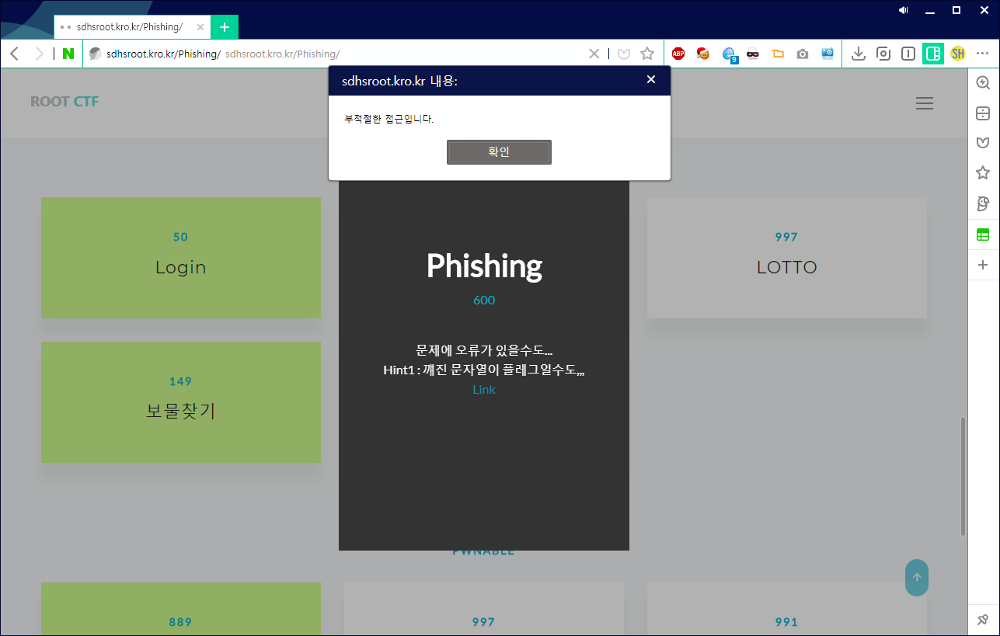
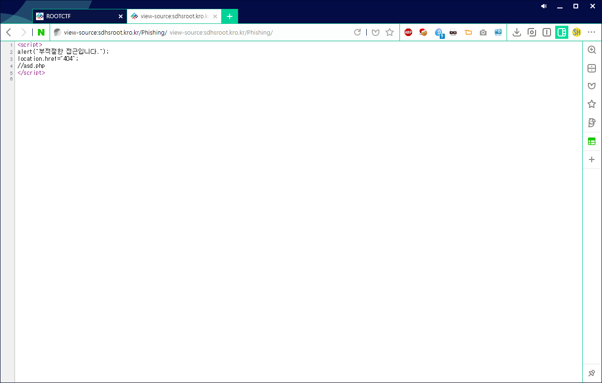
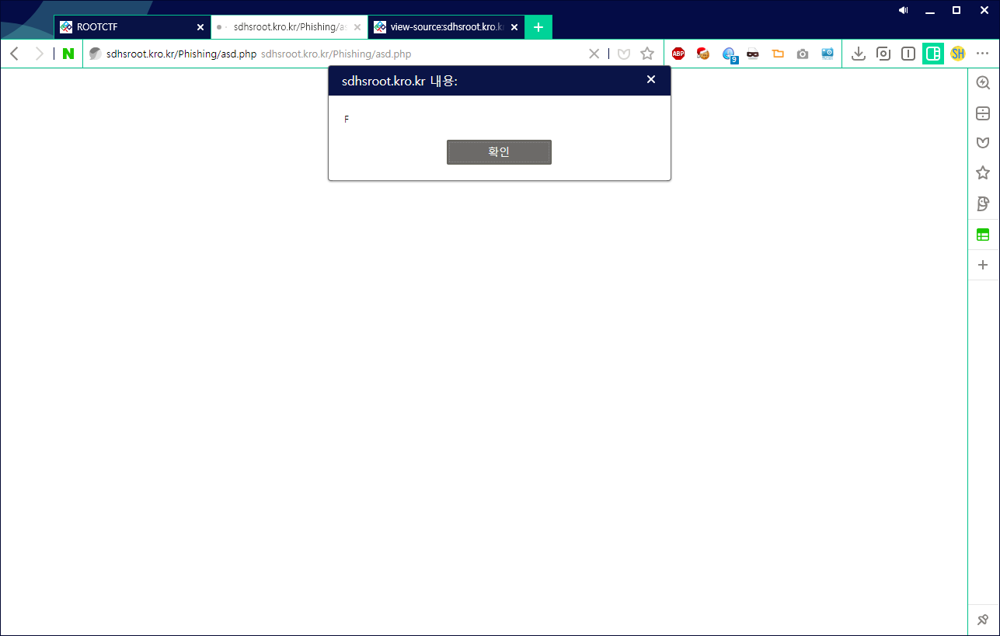
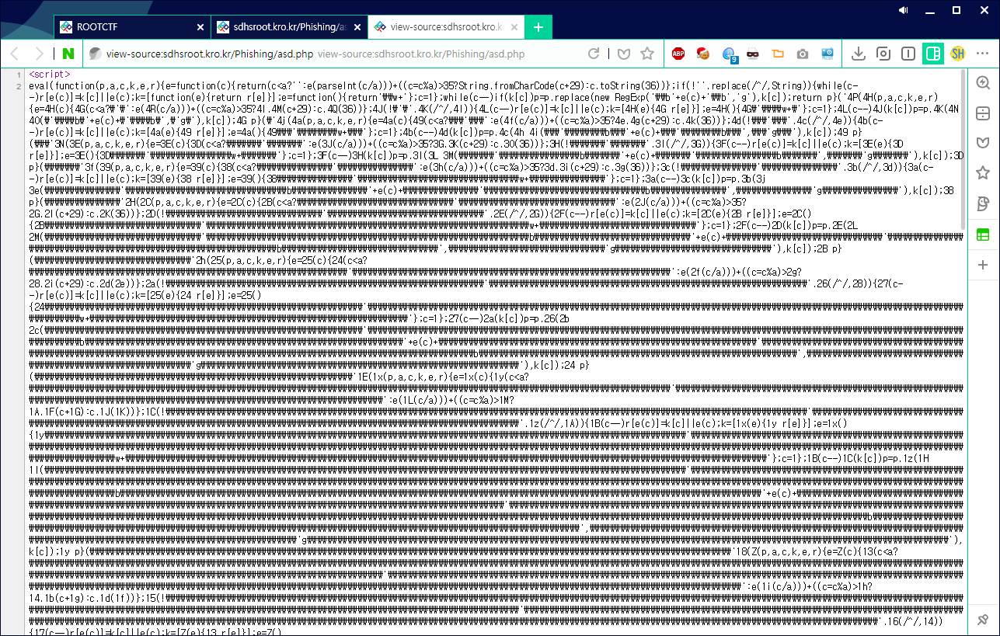
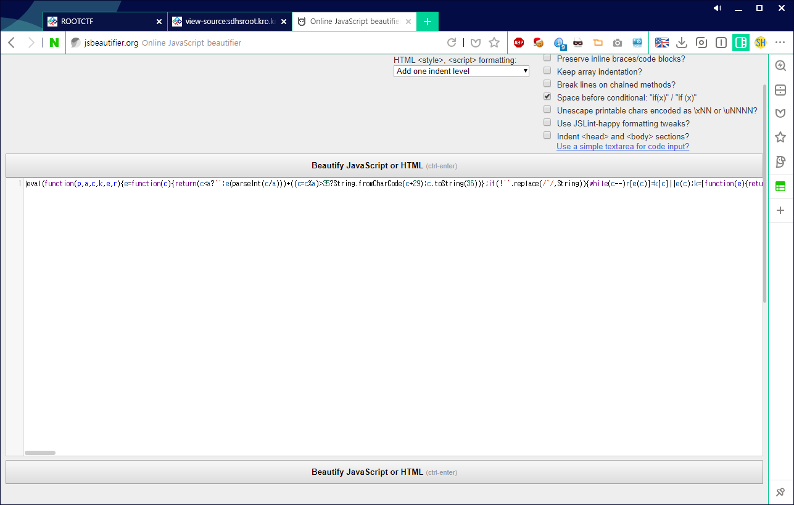
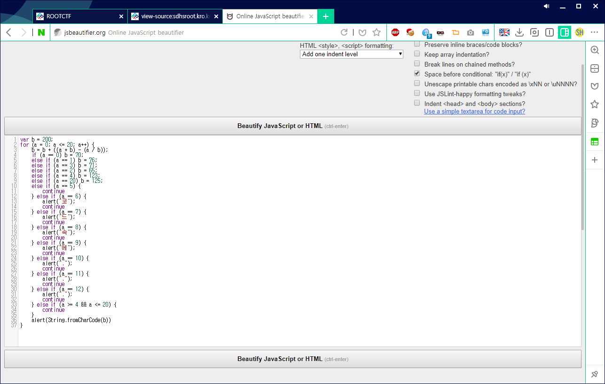
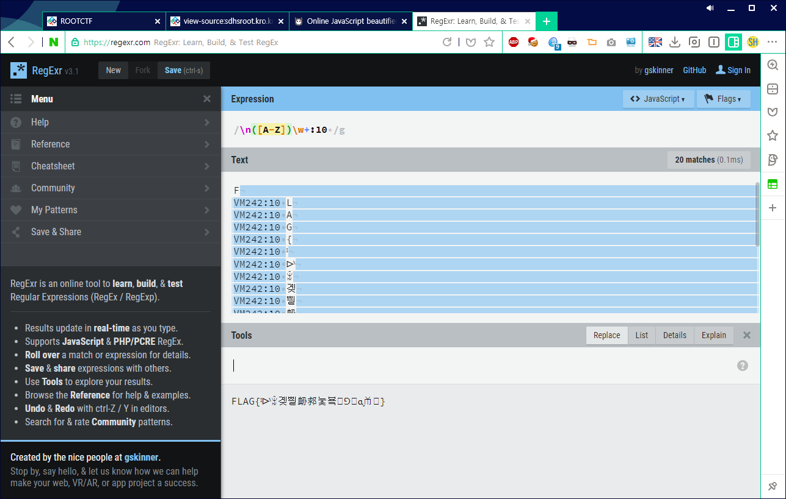

# ROOT CTF 2017 1st
## Overview
Phishing

600

문제에 오류가 있을수도...
Hint1 : 꺠진 문자열이 플레그일수도,,,
Link

## Process

먼저 사이트 들어가면... 띠용?

부적절한 접근이래요 ㅠㅠㅠㅠㅠ 저 잘못 없는데..

그래서 소스를 보아요!

(처음에 풀때는 `Fiddler` 웹 디버거를 썼지만,, 여기선 더 쉽게)

사실 크로니움 기반의 브라우저에서 링크 앞에 view-source: 를 붙이면 소스를 볼 수 있어요!

`view-source:sdhsroot.kro.kr/Phishing/` 여기에 들아가요.

주석으로 `./asd.php` 라고 나와있네요!

이제 `http://sdhsroot.kro.kr/Phishing/asd.php` 에 들어가요.

이런식으로 `FLAG{코드속에...}` 이라는 문자열이 한글자씩 alert 로 나와요..

그래서 코드를 보았더니!

ㅗㅜㅑ...

이럴때 필요한건 뭐다?

이~쁘게 만들어주는 `http://jsbeautifier.org/`

이걸 요로코롬

바꿔줍니다.

(이 사이트는 JS를 포매팅 해주는 사이트인데, 구문 분석하면서 `Detect packers and obfuscators?` 옵션을 주면 난독화도 풀어줘요!)

이제 콘솔에 들어가서 저거 그냥 실행시켜줍시다.

이상한 깨진 문자열이 나왔네요..

저거 직접 입력할 수는 없고, 잘못 하다가는 깨질 수 있으니..

고~대로 복사해서 정규식으로 없애줍시다.

요로코롬.. `https://regexr.com` 에서 replace로 없애줍시다.

## Flag

이런 플래그 내는곳 처음봤다. 신기하다 ㅋ

`FLAG{ˡᐭꅭ곚삍䘐䣇눛뵼ᩎꓨᶐㆰ}`