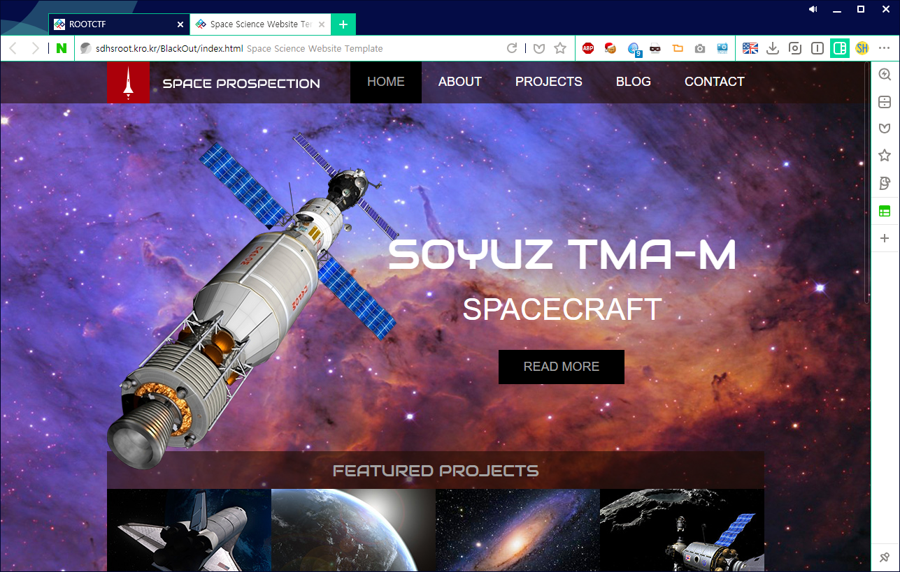
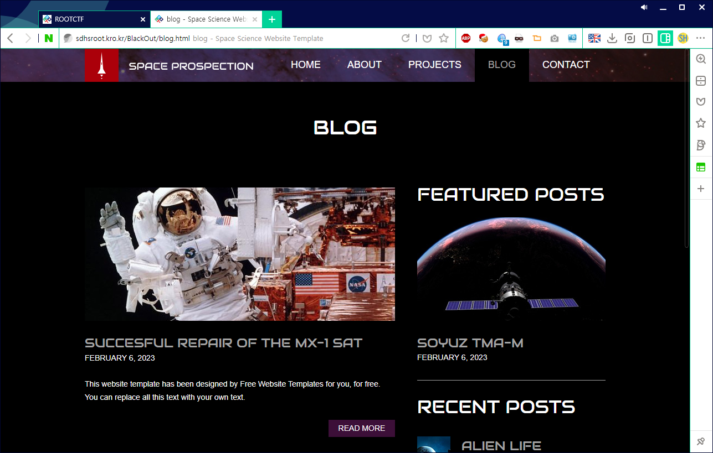
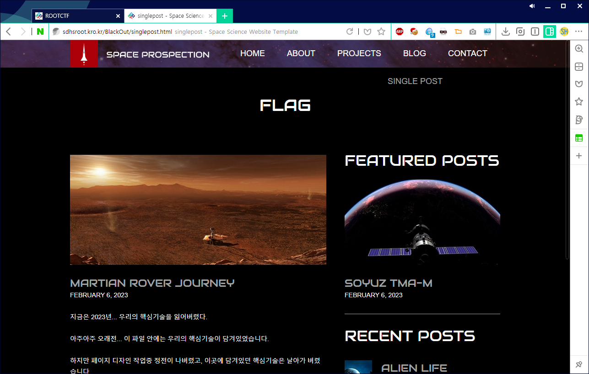
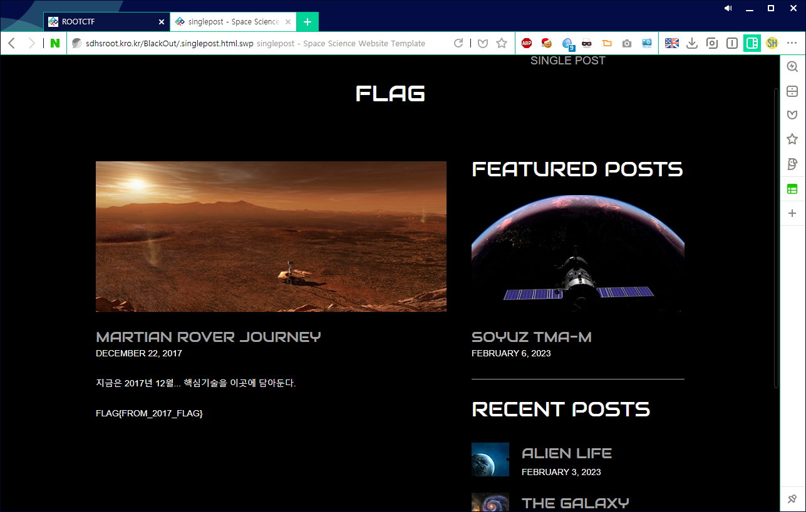

# ROOT CTF 2017 1st
## Overview
SPACE PROSPECTION

529

2023년... SPACE PROSPECTION라는 회사가 화성에 진출했다.
회사의 사이트에 들어가 핵심 기술을 가져오자!!
Link

## Process

주어진 사이트에 들어가면 다음과 같은 블로그가 뜬다.



READ MORE 버튼을 누르면 글 목록을 볼 수 있다.



그리고 READ MORE 버튼을 또 눌러 글을 읽는다.



이 글의 내용은 이렇다.

```
MARTIAN ROVER JOURNEY
FEBRUARY 6, 2023
지금은 2023년... 우리의 핵심기술을 잃어버렸다.

아주아주 오래전... 이 파일 안에는 우리의 핵심기술이 담겨있었습니다.

하지만 페이지 디자인 작업중 정전이 나버렸고, 이곳에 담겨있던 핵심기술은 날아가 버렸습니다.

지금도 이 서버 어딘가에 핵심기술이 담겨있는 파일이 돌아다닐 수 있습니다.
```

정전.. vi blackout 인가보다.

vi 에디터는 정전에 대비하여 백업 파일을 만든다.

_(사실 정확한 이유는 모르는데 swp 파일을 생성해서 그곳에 임시저장한 다음, 나중에 그 파일과 swap 하는건 확실하다.)_

암튼 그래서 파일명 앞에 `.`, 뒤에 `.swp` 를 붙여서 접속하게 되면 플래그가 뜬다.

`http://sdhsroot.kro.kr/BlackOut/singlepost.html` 에서 `http://sdhsroot.kro.kr/BlackOut/.singlepost.html.swp` 으로!




## Flag
`FLAG{FROM_2017_FLAG}`