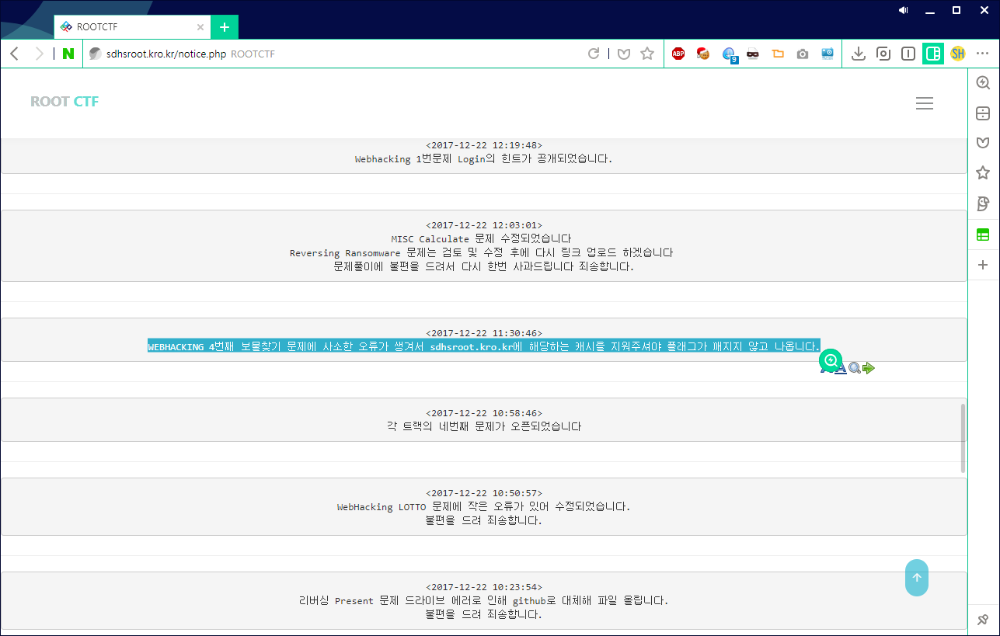
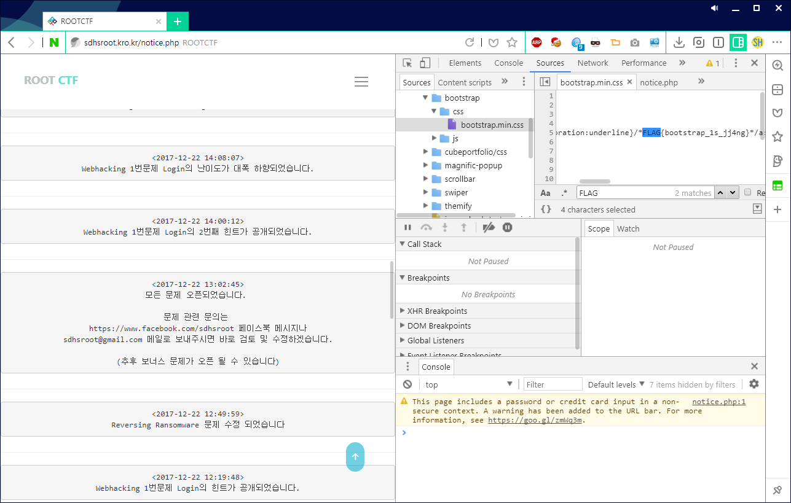

# ROOT CTF 2017 1st
## Overview
보물찾기

149

홈페이지 내에 존재하는 플레그를 찾아보세염!

## Process

사실 이거 가지고 많이 힘들었다.

공지사항에

캐시를 지우란거를 나중에 봤다. ㅋ

그래서 f12 로 개발자 도구를 켠 다음, 돌아다니다 보면

`http://sdhsroot.kro.kr/vendor/bootstrap/css/bootstrap.min.css` 이곳에 있다.

## Flag

`FLAG{bootstrap_1s_jj4ng}`