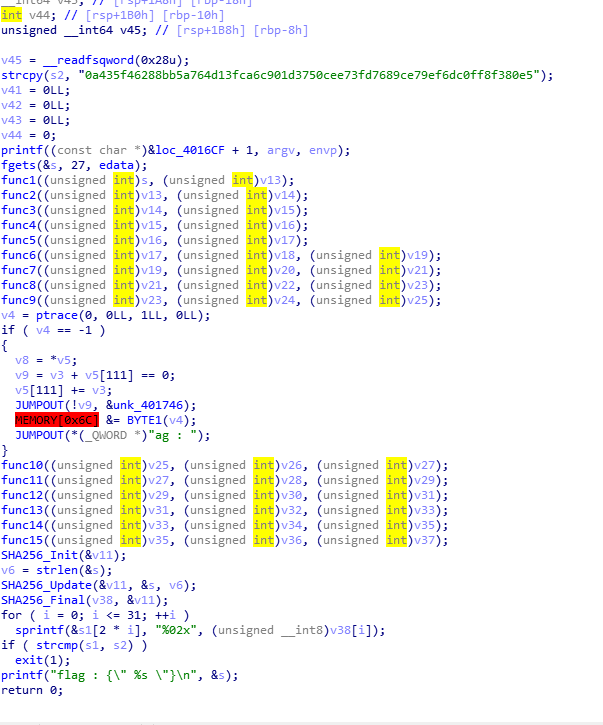

# Codegate 2018 Prequal Reversing RedVelvet

## Overview

```
RedVelvet - 182pts (Rev)
Happiness:)
Solve 28
```

[Download](https://s3.ap-northeast-2.amazonaws.com/codegate2018/afbea1c0a463d63cd6f00389a3b2fe88)

## Solve

### Analysis

This binary receives some input and checks it.

If the input is correct, print this, otherwise it exits the program.



I used `angr`.

### Code

```python
from angr import *

p = Project("./RedVelvet", load_options={'auto_load_libs': False})
ex = p.surveyors.Explorer(find=(0x0000000000401546, ), avoid=(0x00000000004007D0,))
ex.run()

print("\"" + ex.found[0].state.posix.dumps(0) + "\"")
print(ex.found[0].state.posix.dumps(0).encode("hex"))
'''
```

### Output

```
What_You_Wanna_Be?:)_lc_la**\x02\x0e\x8a\x8aJ\x0e\x8a\x8a\x1a\x1a\x02\x08\x0e*JJ\x8a*\x0e\n\x8a*JJ\x02\x02J\x8a\x0b\x8a*\x08\x00
```

change lc to la -> `What_You_Wanna_Be?:)_la_la`

```
shgroup@ubuntu:/mnt/hgfs/Writeup/ctf/codegate/2018-Prequal/Reversing/RedVelvet$ ./RedVelvet
Your flag : What_You_Wanna_Be?:)_la_la
HAPPINESS:)
HAPPINESS:)
HAPPINESS:)
HAPPINESS:)
HAPPINESS:)
HAPPINESS:)
HAPPINESS:)
HAPPINESS:)
HAPPINESS:)
HAPPINESS:)
HAPPINESS:)
HAPPINESS:)
HAPPINESS:)
HAPPINESS:)
HAPPINESS:)
flag : {" What_You_Wanna_Be?:)_la_la "}
```

### Flag

`What_You_Wanna_Be?:)_la_la`