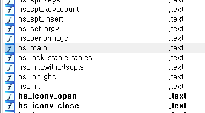

# Codegate 2018 Prequal Reversing easy_serial

## Overview

```
easy_serial - 924pts (Rev)
Solve 2
```

[Download](https://s3.ap-northeast-2.amazonaws.com/codegate2018/f771eb6211d0f2afd59376c3af8f786a)

## Solve

### Analysis

First, I used `IDA` for static analysing.

After opened this binary, I think it is made by Haskell language.

because,



some function names are starts with `hs_`.

I found Haskell decompiler from github.

[Here](https://github.com/gereeter/hsdecomp) (Thank you [Jonathan S](https://github.com/gereeter))

I clone this repository.

And I typed `python ./runner.py ../easy`, but It dosen't worked...

So, I fixed some errors.

This is output of Haskell decompiler

```haskell
Main_main_closure=>> $fMonadIO
    (putStrLn (unpackCString# "Input Serial Key >>> "))
    (>>= $fMonadIO
        getLine
        (\s1dZ_info_arg_0 ->
            >> $fMonadIO
                (putStrLn (++ (unpackCString# "your serial key >>> ") (++ s1b7_info (++ (unpackCString# "_") (++ s1b9_info (++ (unpackCString# "_") s1bb_info))))))
                (case && (== $fEqInt (ord (!! s1b7_info loc_7172456)) (I# 70)) (&& (== $fEqInt (ord (!! s1b7_info loc_7172472)) (I# 108)) (&& (== $fEqInt (ord (!! s1b7_info loc_7172488)) (I# 97)) (&& (== $fEqInt (ord (!! s1b7_info loc_7172504)) (I# 103)) (&& (== $fEqInt (ord (!! s1b7_info loc_7172520)) (I# 123)) (&& (== $fEqInt (ord (!! s1b7_info loc_7172536)) (I# 83)) (&& (== $fEqInt (ord (!! s1b7_info loc_7172552)) (I# 48)) (&& (== $fEqInt (ord (!! s1b7_info loc_7172568)) (I# 109)) (&& (== $fEqInt (ord (!! s1b7_info loc_7172584)) (I# 101)) (&& (== $fEqInt (ord (!! s1b7_info loc_7172600)) (I# 48)) (&& (== $fEqInt (ord (!! s1b7_info (I# 10))) (I# 102)) (&& (== $fEqInt (ord (!! s1b7_info (I# 11))) (I# 85)) (== $fEqInt (ord (!! s1b7_info (I# 12))) (I# 53))))))))))))) of
                    <tag 1> -> putStrLn (unpackCString# ":p"),
                    c1ni_info_case_tag_DEFAULT_arg_0@_DEFAULT -> case == ($fEq[] $fEqChar) (reverse s1b9_info) (: (C# 103) (: (C# 110) (: (C# 105) (: (C# 107) (: loc_7168872 (: loc_7168872 (: (C# 76) (: (C# 51) (: (C# 114) (: (C# 52) [])))))))))) of
                        False -> putStrLn (unpackCString# ":p"),
                        True -> case && (== $fEqChar (!! s1bb_info loc_7172456) (!! s1b3_info loc_7172456)) (&& (== $fEqChar (!! s1bb_info loc_7172472) (!! s1b4_info (I# 19))) (&& (== $fEqChar (!! s1bb_info loc_7172488) (!! s1b3_info (I# 19))) (&& (== $fEqChar (!! s1bb_info loc_7172504) (!! s1b4_info loc_7172568)) (&& (== $fEqChar (!! s1bb_info loc_7172520) (!! s1b2_info loc_7172488)) (&& (== $fEqChar (!! s1bb_info loc_7172536) (!! s1b3_info (I# 18))) (&& (== $fEqChar (!! s1bb_info loc_7172552) (!! s1b4_info (I# 19))) (&& (== $fEqChar (!! s1bb_info loc_7172568) (!! s1b2_info loc_7172504)) (&& (== $fEqChar (!! s1bb_info loc_7172584) (!! s1b4_info (I# 17))) (== $fEqChar (!! s1bb_info loc_7172600) (!! s1b4_info (I# 18))))))))))) of
                            <tag 1> -> putStrLn (unpackCString# ":p"),
                            c1tb_info_case_tag_DEFAULT_arg_0@_DEFAULT -> putStrLn (unpackCString# "Correct Serial Key! Auth Flag!")
                )
        )
    )
s1b4_info=unpackCString# "abcdefghijklmnopqrstuvwxyz"
loc_7172600=I# 9
s1bb_info=!! s1b5_info loc_7172488
loc_7172488=I# 2
s1b5_info=splitOn $fEqChar (unpackCString# "#") s1dZ_info_arg_0
loc_7172584=I# 8
loc_7172504=I# 3
s1b2_info=unpackCString# "1234567890"
loc_7172568=I# 7
loc_7172552=I# 6
s1b3_info=unpackCString# "ABCDEFGHIJKLMNOPQRSTUVWXYZ"
loc_7172536=I# 5
loc_7172520=I# 4
loc_7172472=I# 1
loc_7172456=I# 0
loc_7168872=C# 48
s1b9_info=!! s1b5_info loc_7172472
s1b7_info=!! s1b5_info loc_7172456
```

I can't read this so I formated this.

```haskell
Main_main_closure=>> $fMonadIO
    (putStrLn (unpackCString# "Input Serial Key >>> "))
    (>>= $fMonadIO
        getLine
        (\s1dZ_info_arg_0 ->
            >> $fMonadIO
                (putStrLn(++ (unpackCString# "your serial key >>> ") (++ s1b7_info (++ (unpackCString# "_") (++ s1b9_info (++ (unpackCString# "_") s1bb_info))))))

                (case
                    && (== $fEqInt (ord (!! s1b7_info I# 0)) (I# 70)
                    (&& (== $fEqInt (ord (!! s1b7_info I# 1)) (I# 108))
                    (&& (== $fEqInt (ord (!! s1b7_info I# 2)) (I# 97))
                    (&& (== $fEqInt (ord (!! s1b7_info I# 3)) (I# 103))
                    (&& (== $fEqInt (ord (!! s1b7_info I# 4)) (I# 123))
                    (&& (== $fEqInt (ord (!! s1b7_info I# 5)) (I# 83))
                    (&& (== $fEqInt (ord (!! s1b7_info I# 6)) (I# 48))
                    (&& (== $fEqInt (ord (!! s1b7_info I# 7)) (I# 109))
                    (&& (== $fEqInt (ord (!! s1b7_info I# 8)) (I# 101))
                    (&& (== $fEqInt (ord (!! s1b7_info I# 9)) (I# 48))
                    (&& (== $fEqInt (ord (!! s1b7_info (I# 10))) (I# 102))
                    (&& (== $fEqInt (ord (!! s1b7_info (I# 11))) (I# 85))
                    (== $fEqInt (ord (!! s1b7_info (I# 12))) (I# 53))))))))))))) of

                    <tag 1> -> putStrLn (unpackCString# ":p"),
                    c1ni_info_case_tag_DEFAULT_arg_0@_DEFAULT ->
                    case == ($fEq[] $fEqChar) (reverse s1b9_info)
                        (: (C# 103) (: (C# 110) (: (C# 105) (: (C# 107) (: C# 48 (: C# 48 (: (C# 76) (: (C# 51) (: (C# 114) (: (C# 52) []))))))))))
                    of False -> putStrLn (unpackCString# ":p"), True -> case
                        && (== $fEqChar (!! s1bb_info I# 0) (!! uppercase_string I# 0))
                        (&& (== $fEqChar (!! s1bb_info I# 1) (!! lowercase_string (I# 19)))
                        (&& (== $fEqChar (!! s1bb_info I# 2) (!! uppercase_string (I# 19)))
                        (&& (== $fEqChar (!! s1bb_info I# 3) (!! lowercase_string I# 7))
                        (&& (== $fEqChar (!! s1bb_info I# 4) (!! number_string I# 2))
                        (&& (== $fEqChar (!! s1bb_info I# 5) (!! uppercase_string (I# 18)))
                        (&& (== $fEqChar (!! s1bb_info I# 6) (!! lowercase_string (I# 19)))
                        (&& (== $fEqChar (!! s1bb_info I# 7) (!! number_string I# 3))
                        (&& (== $fEqChar (!! s1bb_info I# 8) (!! lowercase_string (I# 17)))
                        (== $fEqChar (!! s1bb_info I# 9) (!! lowercase_string (I# 18)))))))))))
                        of <tag 1> -> putStrLn (unpackCString# ":p"),
                            c1tb_info_case_tag_DEFAULT_arg_0@_DEFAULT -> putStrLn (unpackCString# "Correct Serial Key! Auth Flag!")
                )
        )
    )
lowercase_string=unpackCString# "abcdefghijklmnopqrstuvwxyz"
number_string=unpackCString# "1234567890"
uppercase_string=unpackCString# "ABCDEFGHIJKLMNOPQRSTUVWXYZ"

s1b5_info=splitOn $fEqChar (unpackCString# "#") s1dZ_info_arg_0
s1bb_info=!! s1b5_info I# 2
s1b9_info=!! s1b5_info I# 1
s1b7_info=!! s1b5_info I# 0
```

It split input with `#` and check it.

1. byte check : The first values of the splitted array, It check that they matches the byte values.
2. reverse check : The second values of the splitted array, It check that they matches the reversed byte values.
3. array selection check : The last values of the splitted array, It check that they matches the selected byte value from lists.
    * lists count is trhee.
    * lowercase strings : `abcdefghijklmnopqrstuvwxyz`
    * highercase strings : `ABCDEFGHIJKLMNOPQRSTUVWXYZ`
    * numberic strings : `1234567890`

So, I read the haskell code and wrote the python code.

### Code

```python
def chrs(cs):
    n = ""
    for c in cs:
        n += chr(c)
    return n

def num(a):
    return (chr(a + ord('1')))

def lo(a):
    return (chr(a + ord('a')))

def up(a):
    return (chr(a + ord('A')))

flag = ""

flag += chrs((70, 108, 97, 103, 123, 83, 48, 109, 101, 48, 102, 85, 53))

flag += "#"

flag += chrs((52, 114, 51, 76, 48, 48, 107, 105, 110, 103))

flag += "#"

flag += up(0) + lo(19) + up(19) + lo(7) + num(2) + up(18) + lo(19) + num(3) + lo(17) + lo(18)

print(flag)
```

### Output

```
Flag{S0me0fU5#4r3L00king#AtTh3St4rs
```

### Flag

`S0me0fU5#4r3L00king#AtTh3St4rs`