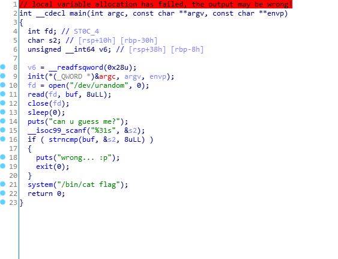

# Ubuntu-ctf misc thumb
## Prob
### thumb  ( 900p )
guess me if you can 
nc 52.78.202.173 10001

다운로드 : https://drive.google.com/open?id=0BzRhYobmfAQzOTZQZTZoeW9Pbzg

## Binary analyzing
I opened this file with `IDA`

It compare input text and /dev/urandom output through `strncmp` function.

`strncmp` function seems to unvulnerable, but combinding with `/dev/urandom`, it sometimes causes a vulunerability.

It because `/dev/urandom` is returns completely random value, and sometimes it will also start with zero(`\x00`).

If you also give `\x00` to input, `strncmp` function will recognize that the input size and return value of `/dev/urandom` size are zero.

Because `\x00` is also called `NULL` and It means the end of the string.

From the point of view of `strncmp`, the first and second parameters size are zero, so these are same value.

## How to solve
1. Input `while true; do perl -e 'print "\x00"x8' | ssh ip port | done`
2. wait...
3. You can see flag!

## Flag
Server closed..