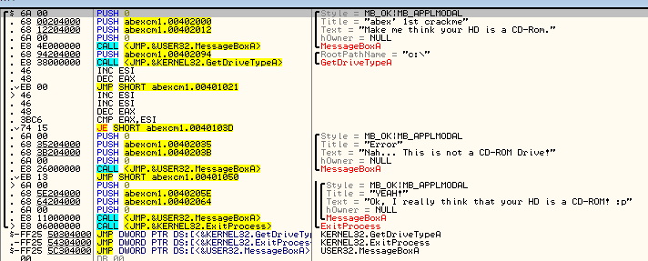
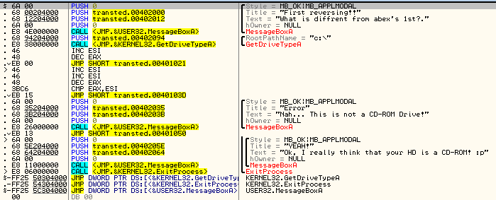

# First_Reversing
## 문제
```
What is diffrent from "abex's crack me 1st"??
Flag is "변경되기 전 명령어_변경된 후 명령어"
(단, 오퍼렌드 제외)

transted abexcm1.exe
abexcm1.exe
```
라고 한다.

Ollydbg 를 통해서 `abexcm1.exe` 파일을 열어보니,



다음과 같이 뜬다.


그 이후 `transted abexcm1.exe` 파일을 열었더니



다음과 같이 떴다.

JE 를 통한 분기문에서 JMP 를 통해 점프해주면서 항상 CD-ROM 으로 인식되었다는 메세지가 뜨는 abex's crackme 바이나리 이다.

즉, JE 에서 JMP 로 바뀌었다.

## 답
> JE_JMP

## 사용 도구
- Ollydbg