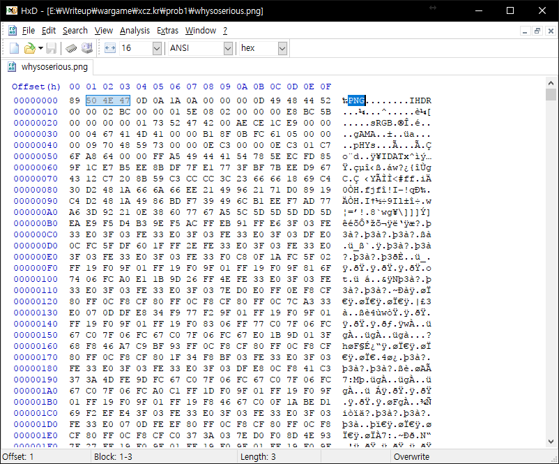
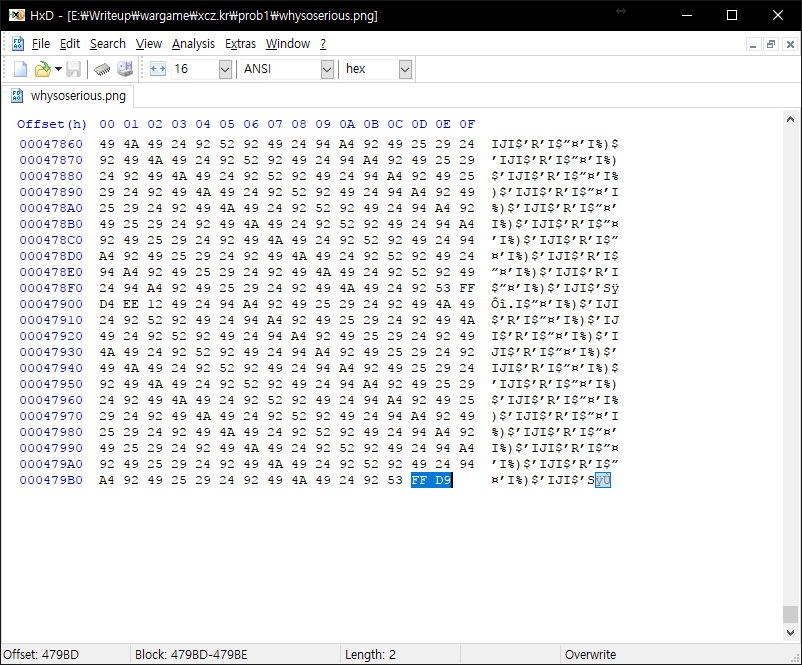
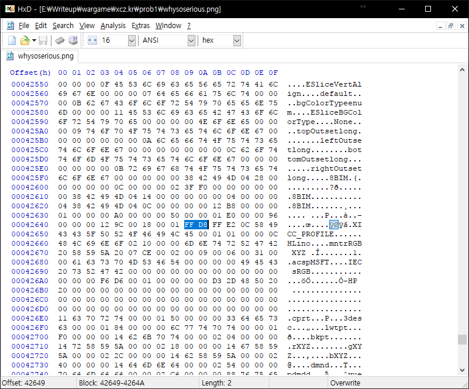
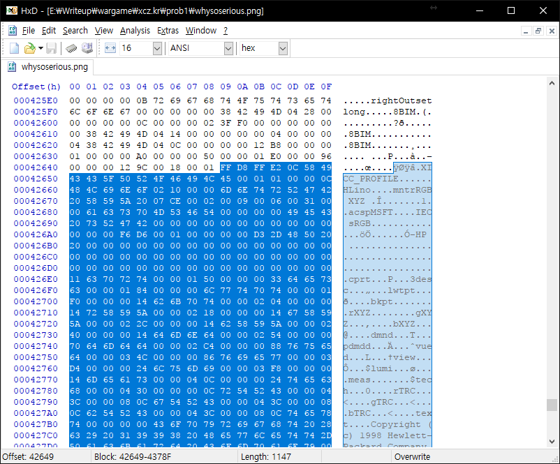
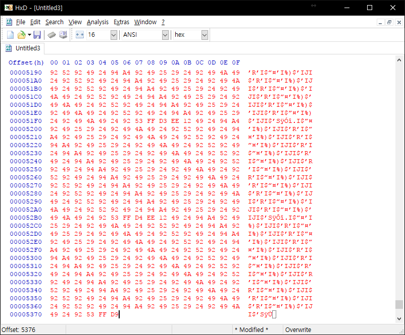

# xcz.kr problem 1

## Overview

Title : End Of Image

Description : 

## How to solve

Open with `Hex Editor`.

This file is `PNG` File.  

But,

File footer is `FF D9`. 
`FF D9` is `JPG` file footer signature..

So, Let's find `FF D8` and copy after datas include `FF D8`.

Finally, I can see flag.

# Flag

`JOg-dragonKER`