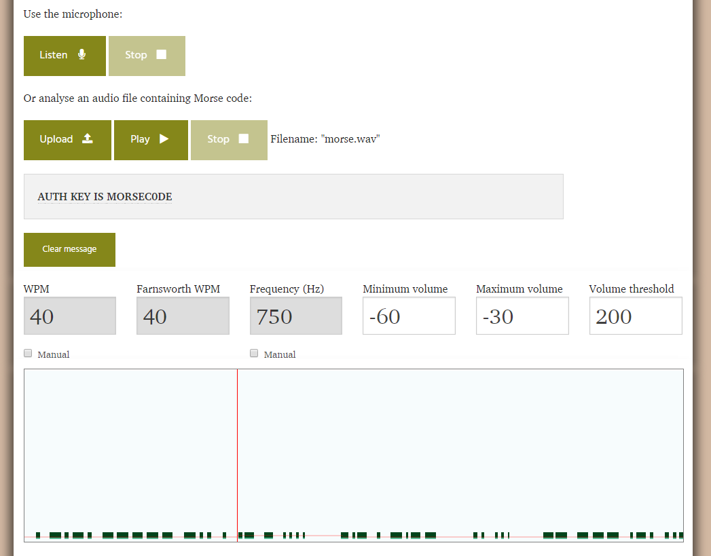

# xcz.kr problem 2

## Overview

### Title

Listen Carefully!

### Description

Hint1. Auth Key = Upper Case

[Download Here](http://xcz.kr/START/prob/prob_files/morse.wav)

## How to solve

It seems to morse code.

Let's use [Morse code decoder online](https://morsecode.scphillips.com/labs/audio-decoder-adaptive/).

# Flag

`MORSEC0DE`