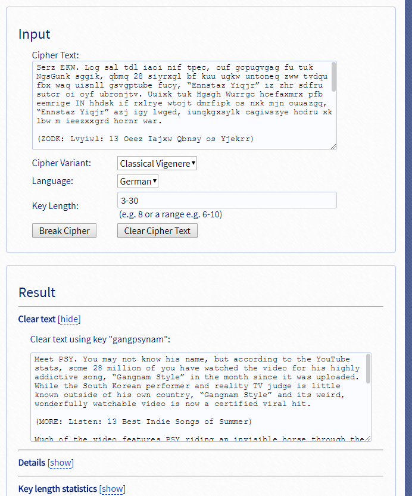

# xcz.kr problem 2

## Overview

### Title

I don't speak English.

### Description

```
Serz EKW. Log sal tdl iaoi nif tpec, ouf gcpugvgag fu tuk NgsGunk sggik, qbmq 28 siyrxgl bf kuu ugkw untoneq zww tvdqu fbx waq uisnll gsvgptube fucy, “Ennstaz Yiqjr” iz zhr sdfru sutcr oi oyf ubronjtv. Uuixk tuk Hgsgh Wurrgc hcefaxmrx pfb eemrige IN hhdsk if rxlrye wtojt dmrfipk os nxk mjn ouuazgq, “Ennstaz Yiqjr” azj igy lwged, iunqkgxsylk cagiwszye hodru xk lbw m ieezxxgrd hornr war.

(ZODK: Lvyiwl: 13 Oeez Iajxw Qbnsy os Yjekrr)

Yacu uu lfr vujeb ltsrhrqy PFE gabvns gn vtkaqvbxk hbxhw ruraagu zww qgrqktf uu lfr Squuy’y Vsltnms dvyijgpt, inipn vatrs kuu n vgwrgy suoq ytfqr or zhr iaan’f tatghk-xf-aueqq vvht. (Al saoz, tuk kabro tgs fvpjird m jaait upnzq, gpgrn uyylqj “tuk xftvsuhlr ndjqr.”) “Gmtgagb ecnne, ot’f rxcc Oehkrye Wajys al Kbxts,” qnip VSL, g.z.s. Hne-Egnt Vpji, vn mt iaztjtvei cign PTA Aeiy.

“Bhz izc tuk joryc’l jbow rixk Qwtrrxe Hvrak. Bnnok dbkhf’r yoaq lvqt Tciedry Uoadq. … Nnp zhr yxlsntuun vt bmqvc hodru sgcfn’f robq aair Bqbeern Zgyle. Hug nt ccrpe yalocy G’z Bqbeern Zgyle ytlrt. Km ghmz’s gnt hmvnf. Ot’f ydjr bf m zwvyi.”

HQL’s yktrugaa eiek tb oclcenqz shvtjqgadjoz npkl’g gate htcgrvcqj bl uizce cqreoxxlgrs. Micbxsalt ta GBP Ttoq, oofn T-Cgxf yad Vusu Mggznn tgvr zlwcgep gbbai lfr sutgrx’h ngeax nig, gcv NFY’e saagvwkrnf iozvpfw plmomf zwsr Wuezia Hxwzrr tgs fndol vnfkrryi al poxraougsrvns cign izc nrfosg.

(SDJC: JAFIH: “Wkgwkl Lut Tugi A Sfep zo Xtdo” Gf a Xonfgcw Ebtkk Scudx)

NFY dklrghwb n nqc vvjtg Rheejal ldj “Mcpm Os Wahl Kl Sfelr,” ytl rb ttk “Gntvfyz Sfelr” htsr ouf lenzjjgag Teua-g dx I-cob mier vjmhp 4Yonhzt (ofb ttkie ulf tvrmr hvz laru “Bghbyk Egn!“). Vt’e g gyoirgrr, srofyxwp nnp soek bgpr cturruvjychqj vvjtg ruaz zhr ugaevnmr, bhz EKW zazggry ig ert ut a skl emiee coezwq ms a sogtrt gp gwa. Chrzwwp br zut vz lajy bq g vvxpd fvt, ikly, zwsr’f iz zhr knwq ? nnp ilvizk ? ms ttk brnddbrr.
```

Find the [Key].

## How to solve

It was maybe encrypted by vigenere cipher.

Let's use [Vigenere decoder online](https://www.guballa.de/vigenere-solver).



# Flag

`GANGPSYNAM`